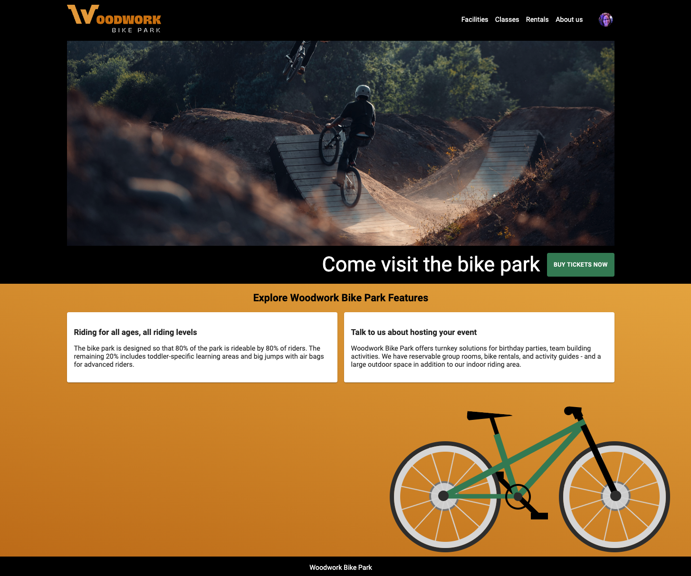
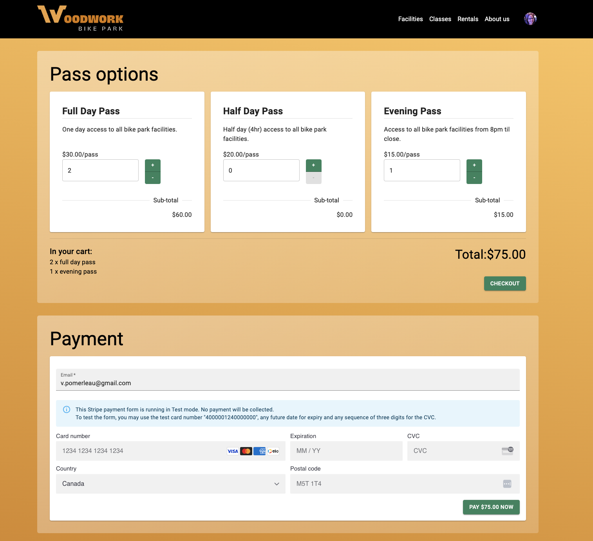
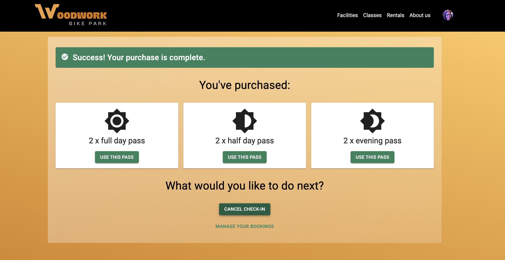

<div align="center">
    
    
  <h1>Woodwork Bike Park Management System</h1>
  
  
<!-- Badges -->
<p>
  <!-- <a href="https://github.com/vpomerleau/bike-park-server/graphs/contributors">
    
  </a> -->
  <a href="">
    
  </a>
  <!-- <a href="https://github.com/vpomerleau/bike-park-server/network/members">
    
  </a>
  <a href="https://github.com/vpomerleau/bike-park-server/stargazers">
    
  </a>
  <a href="https://github.com/vpomerleau/bike-park-server/issues/">
    
  </a> -->
  <a href="https://github.com/vpomerleau/bike-park-server/blob/master/LICENSE">
    
  </a>
</p>

<h4>
    <a href="https://github.com/vpomerleau/bike-park-server/issues/">Report Bug</a>
  <span> · </span>
    <a href="https://github.com/vpomerleau/bike-park-server/issues/">Request Feature</a>
  </h4>

</div>

<br />

# Client-side Repository

<a href="https://github.com/vpomerleau/bike-park-client">
  <p>https://github.com/vpomerleau/bike-park-client</p>
</a>

# Server-side Repository
<a href="https://github.com/vpomerleau/bike-park-server">
  <p>https://github.com/vpomerleau/bike-park-server</p>
</a>

<br />

<!-- Table of Contents -->
# Table of Contents

- [About the Project](#about-the-project)
  * [Screenshots](#screenshots)
  * [Dependencies](#dependencies)
  * [Features](#features)
  * [Color Reference](#color-reference)
  * [Environment Variables](#environment-variables)
- [Getting Started](#getting-started)
  * [Prerequisites](#prerequisites)
  * [Install a local copy](#install-a-local-copy-of-the-project)
  * [Server setup](#server-setup)
  * [Install the databse](#mysql-database-setup)
  * [Run Locally](#run-locally)
- [Roadmap](#roadmap)
- [License](#license)
- [Contact](#contact)
- [Acknowledgements](#acknowledgements)
  

<!-- About the Project -->
# About the Project


<!-- Screenshots -->
### Screenshots

<figure align="center"> 
  
  <figcaption>Woodwork Bike Park Home Page</figcaption>
</figure>

<figure align="center"> 
  
  <figcaption>Woodwork Bike Park Purchase Page showing Stripe Payment Element</figcaption>
</figure>

<figure align="center"> 
  
  <figcaption>Woodwork Bike Park Purchase Confirmation Page Page, showing purchased products and option to check-in</figcaption>
</figure>

<!-- Features -->
## Features

- Authentication with Auth0
- Payments with Stripe

<!-- Dependencies -->
## Tech Stack

  <summary>Client</summary>
  <ul>
    <li><a href="https://reactjs.org/">React.js</a></li>
    <li><a href="https://mui.com/">Material UI</a></li>
    <li><a href="https://sass-lang.com/">Sass</a></li>
    <li><a href="https://axios-http.com/">Axios</a></li>
    <li><a href="https://auth0.com/">Auth0</a></li>
    <li><a href="https://stripe.com/en-ca">Stripe</a></li>
  </ul>

  <summary>Server</summary>
  <ul>
    <li><a href="https://nodejs.org/en/">Node.js</a></li> 
    <li><a href="https://expressjs.com/">Express.js</a></li>
    <li><a href="https://knexjs.org/">Knex.js</a></li>
  </ul>

<summary>Database</summary>
  <ul>
    <li><a href="https://www.mysql.com/">MySQL</a></li>
  </ul>

<!-- Color Reference -->
## Color Reference

| Color             | Hex                                                                |
| ----------------- | ------------------------------------------------------------------ |
| Brand Color (light) |  #D67A00 |
| Brand Color (dark) |  #EBA13F |
| Accent Color |  #2e845d |
| Text Color (on dark) |  #FFFFFF |
| Dark Background/Text Color (on white) |  #000000 |


<!-- Env Variables -->
## Environment Variables (Server)

To run this project, you will need to add the following environment variables to your .env file. See env.sample file for more details.

`PORT`

`CLIENT_ORIGIN_URL`

`AUTH0_AUDIENCE`

`AUTH0_DOMAIN`

`STRIPE_SECRET_TEST_KEY`

<!-- Getting Started -->
# Getting Started

<!-- Prerequisites -->
## Prerequisites

This project uses Node as package manager 

[See Node intallation instructions](https://docs.npmjs.com/downloading-and-installing-node-js-and-npm)

```bash
 npm install -g npm
```

You will need accounts with Auth0 and Stripe to obtain your environment variables. Make sure that values provided in the Auth0/Stripe dashboards perfectly matches the values entered in your environment variables, or the app might not load (will return errors).

[Get an account with Auth0](https://auth0.com/signup)

[Get an account with Stripe](https://dashboard.stripe.com/register)

<!-- Local Copy -->
## Install a local copy of the project

Make a top level project directory to hold the client and server-side code

 ```bash
  mkdir bike-park-project
  cd bike-park-project
 ```

Clone the client and server into the top level folder (two new folders will be created)

```bash
  git clone https://github.com/vpomerleau/bike-park-client.git
  ```

```bash
  git clone https://github.com/vpomerleau/bike-park-server.git
```

## Server setup

Go to the server directory

```bash
  cd bike-park-server
```

Install dependencies

```bash
  npm install
```

[Set up the environment variables](#environment-variables) by creating a new .env file from .env.sample

Modify your .gitignore file to cover your needs - [Toptal's gitignore.io](https://www.toptal.com/developers/gitignore) is a useful tool to get a template by searching for package manager, OS, etc. For this project, recommended to at least include Node.

## MySQL database setup

You will need to install mySQL if you don't have it yet.
 ``` 
 https://dev.mysql.com/downloads/mysql/
 ```

Make sure to remember the password for your 'root' user! For example by storing it with a password manager.

In order to access MySQL from the command line, you will need to update your PATH.

*For Windows*

1. Right click on the Windows Start Menu and select System
2. Under "Related settings" click on Advanced system settings
3. Under the "Advanced" tab click on Environment Variables
4. Select Path and click Edit
5. Click New, and add the following. Replace X.X with your version of MySQL, for example 8.0:

```C:\Program Files\MySQL\MySQL Server X.X\bin```

6. Click OK
7. In your command line, you should now be able to run the command ```mysql --version``` and see the installed version of MySQL.

*For Mac*

1. Open terminal and enter:

  ```
    touch ~/.zshrc && open ~/.zshrc
  ```

2. Add the following line to the file:

```
  export PATH=$PATH:/usr/local/mysql/bin
```

3. Save and close the file

4. In a new terminal, you should now be able to run the command ```mysql --version``` and see the installed version of MySQL.

### Create the bike-park database

1. Start your MySQL server on the command line, if it is not currently running.

```
  mysqld
```

2. Log into MySQL from the command line:

```
  mysql -u root -p
```

You will be asked for your password

3. At this point you should see the MySQL prompt:

```
mysql>
```

4. Create a database called "bikepark"

```
CREATE DATABASE bikepark;
```
###  Database migration and seeding with knex
Copy ```knexfile-example.js``` and rename as ```knexfile.js```. Add your mySQL 'root' password where indicated.

Run migration

```
npm run migrate
```

Seed database with example data

```
npm run seed
```

If you need to reset the database, you can drop the tables by running:

```
npm run migrate:down
```

## Run the server-side

In development mode (server restarts any time there are changes to the file) - uses nodemon

```bash
  npm run dev
```
To require manual restarts of server when code is update, use node instead

```bash
  npm run start
```

## Client setup
[See Client-side readme](https://github.com/vpomerleau/bike-park-client/blob/develop/README.md) for detailed client installation instructions.

# Roadmap

* [x] Proof of concept homepage
* [x] Auth0 integration (dev mode)
* [x] Stripe integration (dev mode)
* [ ] User profile updates
* [ ] User controlled booking management (incl. transferring tickets to other riders)
* [ ] Unit testing
* [ ] Phases 2 to 1,000 to build a full-featured bike park management system

<!-- License -->
# License

Distributed under the MIT License. See LICENSE.txt for more information.

# Contact

Valerie Pomerleau - [Twitter @PomerleauVal](https://twitter.com/PomerleauVal) - [LinkedIn @valeriepomerleau](https://www.linkedin.com/in/valeriepomerleau/) 

## Project Link

(client): [https://github.com/vpomerleau/bike-park-client](https://github.com/vpomerleau/bike-park-client)

(server): [https://github.com/vpomerleau/bike-park-server](https://github.com/vpomerleau/bike-park-server)

# Acknowledgements

Thank you to BrainStation for the knowledge, wisdom and support! In particular, I'd like to thank my May 2022 Web Dev cohort's educators ([Daniil Molodkov](https://daniil.ca), [Michael Ti](https://michaelti.ca/), [Andrew Carolan](https://github.com/andrewcarolan)) and TAs ([Brishan King](https://github.com/brishan3) and [Slobodan Zaja](https://github.com/brunash)).

## Useful resources 

 - Bike Lorem Ipsum from [Bicycle Ipsum](https://cogdog.github.io/bicycle-ipsum/)
 - Logo design with [Canva](https://www.canva.com/)
 - Mountain bike animation adapted from: [Pure CSS bike animation](https://codepen.io/lucawater/pen/VwQVyj)
 - Database schema planning with [LucidChart](https://lucid.app/lucidchart/5ad69e98-8a23-448b-a979-63d8dca1a07b/edit?viewport_loc=-515%2C-100%2C2616%2C1481%2C0_0&invitationId=inv_a0392367-744c-4dc4-97de-515ca6583dd1#)
 - [Auth0 API docs](https://auth0.com/docs/)
 - [Stripe API docs](https://stripe.com/docs/api)
 - [Stripe Dev Support on Discord](https://discord.com/invite/stripe)
 - [Shields.io](https://shields.io/)
 - [Awesome README template](https://github.com/Louis3797/awesome-readme-template)